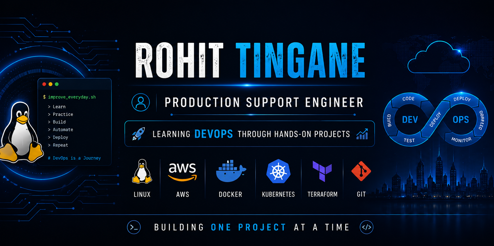

<h1 align="center">Hi 👋, I'm Rohit Tingane</h1>

<h3 align="center">
Production Support Engineer | Learning DevOps Through Hands-on Projects 🚀
</h3>

Building practical skills in Linux, AWS, Docker and Cloud technologies while transitioning into DevOps.

---

## 👨‍💻 About Me

- 💼 4+ Years of experience in Production Support
- 🐧 Comfortable working with Linux Administration
- ☁️ Learning AWS through hands-on projects
- 🐳 Exploring Docker and Containerization
- 🔄 Learning CI/CD using GitHub Actions
- ☸️ Currently learning Kubernetes
- ⚙️ Currently learning Terraform
- 📖 Documenting my DevOps journey publicly on GitHub

---

## 🛠️ Tech Stack

---

## 📚 Currently Learning

---

## 🎯 2026 Goals

- ✅ Complete 90 Days of DevOps
- 🚀 Build real-world DevOps projects
- ☁️ Strengthen AWS fundamentals
- ☸️ Gain hands-on Kubernetes experience
- ⚙️ Learn Infrastructure as Code with Terraform
- 💼 Transition into a DevOps Engineer role

---

## 🚀 Featured Project

### 📘 90 Days of DevOps

A structured hands-on learning journey where I practice Linux, AWS, Git, Docker, CI/CD and DevOps concepts while documenting everything on GitHub.

---

---

## 📊 GitHub Stats

  

  

## 📊 GitHub Streak

---

## 🏆 GitHub Trophies

## 📫 Connect With Me

&nbsp;&nbsp;

---

## 💡 Current Focus

- Linux Administration
- AWS Fundamentals
- Docker (Learning)
- Git & GitHub
- GitHub Actions
- Kubernetes (Learning)
- Terraform (Learning)

---

> 🚀 **Learning in public, building real projects, and improving one day at a time.**

